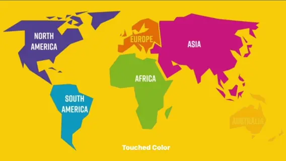

# WWImageView
[](https://developer.apple.com/swift/) [](https://developer.apple.com/swift/)  [](https://developer.apple.com/swift/) [](https://developer.apple.com/swift/)

### [Introduction - 簡介](https://swiftpackageindex.com/William-Weng)
- Enhance the functionality of UIImageView (you can get the above color).
- 加強UIImageView的功能 (可以取得上面的顏色)。



### [Installation with Swift Package Manager](https://medium.com/彼得潘的-swift-ios-app-開發問題解答集/使用-spm-安裝第三方套件-xcode-11-新功能-2c4ffcf85b4b)
```bash
dependencies: [
    .package(url: "https://github.com/William-Weng/WWImageView.git", .upToNextMajor(from: "1.0.0"))
]
```

### Function - 可用函式
|函式|功能|
|-|-|
|color(with:)|取得該點的顏色值|

### [WWImageViewDelegate](https://ezgif.com/video-to-webp)
|函式|功能|
|-|-|
|touched(imageView:colorResult:)|取得點到的畫面顏色|

### Example
```swift
import UIKit
import WWImageView

final class ViewController: UIViewController {
    
    @IBOutlet weak var colorView: UIView!
    @IBOutlet weak var myImageView: WWImageView!
    
    override func viewDidLoad() {
        super.viewDidLoad()
        myImageView.delegate = self
        myImageView.isUserInteractionEnabled = true
    }
}

extension ViewController: WWImageViewDelegate {
    
    func touched(imageView: WWImageView, colorResult: Result<UIColor, Error>) {
        
        switch colorResult {
        case .failure(let error): print(error)
        case .success(let color): colorView.backgroundColor = color
        }
    }
}
```

